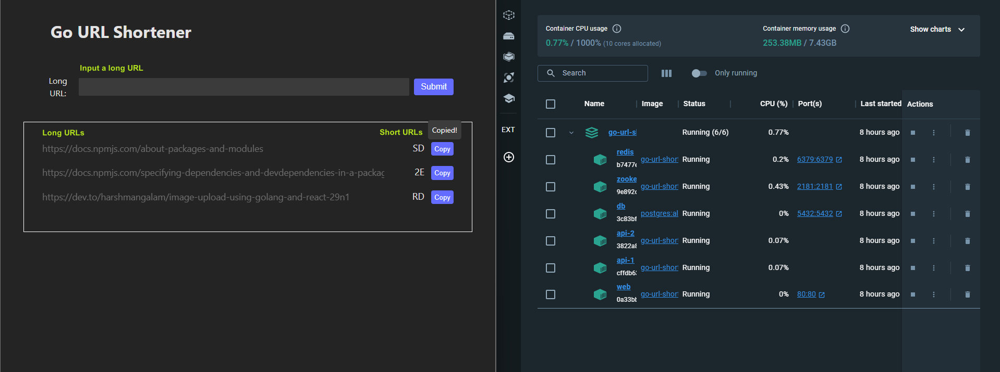
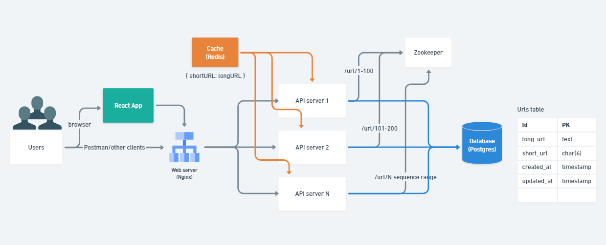

# Go URL Shortener

Design a URL shortening service similar to TinyURL, with the following goals:

Functional Requirements:
1. Given a URL, generate a shorter alias for it.
2. When accessing a shorter alias, redirect to the original link.

Non-functional Requirements:
1. **Availability**: The system must be highly available for URL redirection.
2. **Low Latency**: The system should perform at low latency to provide a smooth user experience.
   
## 🎉 Demonstration
All services are managed on Docker using Docker-compose. The services include 1 web server, 2 API servers, 1 Zookeeper, 1 Redis, and 1 PostgreSQL. For more details, refer to [How to Run](#🚀-how-to-run).

## 📁 Project Structure

- **front**: This directory contains the frontend code of the project. It has been developed using `React/Typescript`. It is containerized with `Nginx` to serve static content and assign requests to the backend services.

- **back**: This directory contains the backend code of the project. It has been developed using `Go` and other relevant tools. As the API service, the backend must operate alongside other services, such as `Postgres`, `Zookeeper`, and `Redis`.

- **dockerconfig**: This directory stores Dockerfiles and config files of other required services, such as `Redis` and `Zookeeper`. These files will be used when launching docker-compose.
  
## 🛠️ System Architecture 🚧

The system comprises different components: 

- A web server is a `React` application with `Nginx`.
- API server replicas that handle `HTTP/RPC` requests/responses, a unique ID generator, and `Base62`. 
- A `Zookeeper` provides distributed synchronization and supports the unique ID generation by maintaining sequence range for each API server replica. 
- A database stores the mapping of long and short URLs. `PostgreSQL` was chosen to focus on the performance of the application layer, with storage performance considered a future enhancement. 
- Furthermore, frequent read requests are cached by `Redis` to reduce latency and boost response times.

## 🚀 How to Run

1. Clone the repository to your local machine.
2. Ensure that the Docker is already installed and running.
3. Create a `.env` file with the required settings (`make gen.env`).
4. Run `make app.start` to wait for all containers to run.
5. Open the browser and go to `http://localhost` to see the frontend app.

