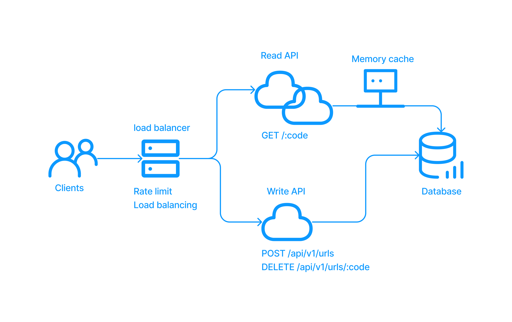

# Go URL Shortener
The Go URL shortener allows users to create unique shortened code aliases for long and complex URLs. The project was built using the following technologies:

- Gin: used to handle HTTP requests and responses.
- Gorm: used to simplify interactions with the PostgreSQL database.
- PostgreSQL: used to store and retrieve data for the application.
- Redis: used to cache frequently accessed data for improved performance.
- Docker: used to package the application and its dependencies into containers for easy deployment and scalability.
- Nginx: used to distribute incoming requests to multiple instances and rate limit.

## Installation and Setup

### Prerequisite
- Go 1.16+
- Docker, we use `docker-compose` to boot up all required services

### Run it via Docker compose

1. Clone the repository to your local machine.
2. Ensure that Docker is installed and running on your machine.

```
// start all services
docker compose up

// stop all services
docker compose down
```
3. Access the application at http://localhost

## Usage

### API: Shorten a URL
- Send a POST request to `http://localhost/api/v1/urls` with a JSON body containing a long URL you want to shorten. For example:

```json
{
  "url": "www.example.com/foo/bar?user=123"
}
```

- The response will be a JSON object containing the original URL, the shortened URL, and a shortcode. For example:

```json
{
    "message": "Short URL created successfully",
    "data": {
        "short_url": "abc",
        "expiration": null
    }
}
```

### API: Redirect to the original URL
-  send a GET request to `http://localhost/{shortcode}`, For example, `http://localhost/abc` will redirect to `www.example.com/foo/bar?user=123`.

### API: Delete the shortened URL
-  send a DELETE request to `http://localhost/api/v1/urls/{shortcode}`.

### System architecture
The system architecture was designed for high availability, to ensure the system remains operational even if one or more components fail.
<p align="center">

</p>

## Test

We can run tests without `docker compose up`

```
// run thru all test cases
go test -v ./internal/...

// run specific test files
go test -v ./internal/usecase/.

// run thru all test cases with test coverage
go test -v -coverprofile=coverage.txt -cover ./internal/...
```

## Contributors
- Weilong Fan (IgnacioFan): developer and maintainer

## References
- https://github.com/JamesYu608/piccollage-problem2-shorten-url
- https://github.com/davidwu1997/ShortURL
- https://www.youtube.com/watch?v=JQDHz72OA3c
- https://github.com/vishnubob/wait-for-it (for script)
