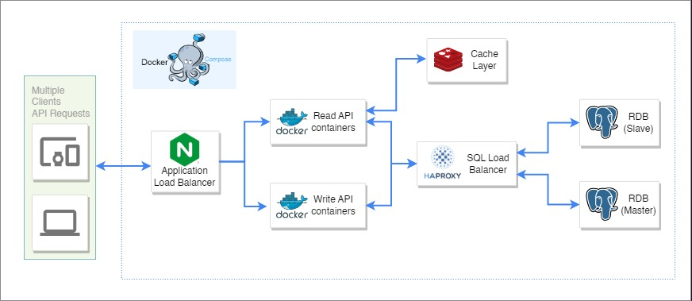

# Go URL Shortener

## Table of Contents

- [Go URL Shortener](#go-url-shortener)
  - [Table of Contents](#table-of-contents)
  - [Prerequisite](#prerequisite)
  - [How to run](#how-to-run)
    - [How to test?](#how-to-test)
  - [Design Concepts](#design-concepts)
    - [Requirements](#requirements)
    - [System Architecture](#system-architecture)
    - [API Design](#api-design)
    - [Database Design](#database-design)
    - [Security Design](#security-design)
    - [Testing](#testing)
  - [Contributors](#contributors)
  - [References](#references)

## Prerequisite
- Go 1.16+
- Docker, the project is based on `docker-compose.yml` to boot up all runnable services

## How to run
1. Clone the repository to your local machine.
2. Ensure that Docker is installed and running on your machine.
3. Create a `.env` file and do some settings.
4. Run `make app.start`
5. Test the following API endpoints
    - Create a shortened URL. For example, send a POST request to `http://localhost/api/v1/urls` with a JSON body
    ```json
    {
      "url": "www.example.com/foo/bar?user=123"
    }
    ```
    - URL Redirecting. For example, send a GET req`uest to `http://localhost/${shortcode}`
    - Delete a shortened URL. For example, send a DELETE request to `http://localhost/api/v1/urls/{shortcode}`

6. Run `make app.stop` to clean up the containers

### How to test?
1. xx
2. Run `xxx`


To know more about other executable commands, please check out the Makefile.

## Design Concepts
The Go URL shortener allows users to create unique shortened URLs that redirect to the original URLs.

### Requirements
The basic functional requirements of the system include
1. The user can create/delete a short URL.
2. The user can visit a short URL and be redirected to the original URL.

The system focuses on two non-functional requirements: availability and effective performance. It must be able to handle requests and responses at any time and respond in under 0.1 seconds on average.

### System Architecture
The system consists of 4 components
- Web Server (NGINX)
- API server (Short URL)
- Caching (Redis)
- Database (PostgreSQL)

<p align="center">

</p>

### API Design

- Endpoint `/api/v1/urls`
  - Method: POST
  - Description: Create a short URL
- Endpoint `/api/v1/urls/:id`
  - Method: DELETE
  - Description: Delete a short URL
- Endpoint `/:id`
  - Method: GET
  - Description: URL redirection

### Database Design

ShortUrl
- id integer
- url string
- expired_at

### Security Design
Developers often underestimate the importance of security in software. I have taken several security approaches to prevent well-known attacks such as SQL injection, and CSRF, while designing the system.

The security approaches are
- Inputs validation uisng `govalidator`
- xx headers

### Testing
To ensure the quality of the code, I implemented two testing strategies: unit tests and integration tests. For the testing framework, I relied primarily on the built-in `testing` package in Go, as well as other helpful dependencies like `sqlmock` and `testify`. Additionally, I utilized `go-sqlmock` specifically for testing SQL.

All of my test cases can be found in the `./test` directory. There are two types of testing: Unit testing, which involves testing individual functions, and Integration testing, which tests API endpoints and requires a test environment setup.

## Contributors
- Weilong Fan (IgnacioFan): developer and maintainer

## References
- https://github.com/JamesYu608/piccollage-problem2-shorten-url
- https://github.com/davidwu1997/ShortURL
- https://www.youtube.com/watch?v=JQDHz72OA3c
