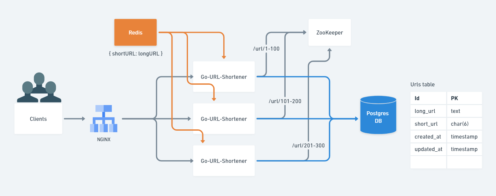

# Go URL Shortener

Welcome to visit my project! This repo showcases the design of a URL Shortener (or TinyURL). The implementation delves into functional and non-functional aspects of system architecture.

Functional Requirements
1. URL Shortening: efficiently shorten URLs.
2. Redirection: redirect visitors when inputting a shortened link.

Non-functional Requirements
1. High Availability: supports load balancing and replications.
2. Scalability: handles increasing workloads with caches and goroutines.
3. Reliability: ensures through automation testing and non-duplicated ID generator.


## Table of Contents

- [Go URL Shortener](#go-url-shortener)
  - [Table of Contents](#table-of-contents)
  - [Prerequisite](#prerequisite)
  - [Dependencies](#dependencies)
  - [How to run](#how-to-run)
  - [System Design Overview](#system-design-overview)
    - [Unique URL Generation](#unique-url-generation)
    - [Load Balancing for Optimal Performance](#load-balancing-for-optimal-performance)
    - [Data Management with Postgres and Redis](#data-management-with-postgres-and-redis)
  - [Project Structure](#project-structure)
  - [API Endpoints](#api-endpoints)
  - [Implementation Details](#implementation-details)
    - [Shorten URL](#shorten-url)
    - [URL Redirection](#url-redirection)
  - [Test Implementation Details](#test-implementation-details)
    - [Unit Tests](#unit-tests)
    - [Integration Tests](#integration-tests)
  - [Challenges and Solutions](#challenges-and-solutions)
    - [Removing Expired URLs](#removing-expired-urls)
    - [Addressing Read/Write Bottlenecks for Relational Databases](#addressing-readwrite-bottlenecks-for-relational-databases)
  - [References](#references)

## Prerequisite
- Go 1.16+
- Docker, the project is based on `docker-compose.yml` to boot up runnable services

## Dependencies

- `cobra`: a CLI framework for building command-line applications.
- `gin`: a REST API framework facilitating efficient APIs.
- `grpc`: a RPC API framework constructing communication between services.
- `protobuf`: a RPC API compiler to define and serialize structured data.
- `gorm`: an ORM library for simplifying database interactions.
- `postgres`: Postgre Driver for connecting to PostgreSQL databases.
- `gomigrate`: a migration library for versioning and applying database schema changes.
- `go-zookeeper`: a ZooKeeper client for creating a non-duplicated ID generator.
- `redis`: a Redis client for utilizing Redis as a caching layer.
- `mock`: a test tool for creating mock objects and simulating behaviors during testing.
- `testify`: a test framework providing additional utilities and assertions for testing.

## How to run
1. Clone the repository to your local machine.
2. Ensure that the Docker is installed and running.
3. Create a `.env` file with the required settings (`make gen.env`).
4. Run `make app.start` to launch all containers.
5. Run `make app.stop` to gracefully shut down the containers.

## System Design Overview
All services are managed through Docker containers to create a scalable architecture. The central hub, Go URL Shortener, handles `HTTP` and `RPC` requests and responses.

<p align="center">

</p>

### Unique URL Generation
Each application generates a unique sequence range with a corresponding counter. The counter's value is used as an ID and encoded into a short URL string with the `Base62` approach, ensuring the uniqueness of each request.

When a new replica is launched, it registers its sequence range in `ZooKeeper.` If the range already exists, replicas will continuously try to find a fresh, non-registered range. If the counter goes out of range, the replica will re-register a new range on `ZooKeeper.`

### Load Balancing for Optimal Performance
In front of the replicas stands `NGINX`, serving as a load balancer. `NGINX` employs the round-robin method, distributing incoming requests across the available replicas. This architecture ensures optimal resource utilization and a balanced workload distribution.

### Data Management with Postgres and Redis
All write requests are managed by `Postgres`. To further enhance performance, frequent read requests are cached by `Redis`, reducing latency and boosting response times.

## Project Structure

```
├── cmd/
├── dockerconfig/
├── internal/
│   ├── adapter/
│   ├── app/
│   ├── entity/
│   ├── migration/
│   ├── repository/
│   ├── service/
│   └── util/
├── test/
│   ├── integration/
│   ├── mocks/
│   └── unit/
├── go.mod
├── go.sum
└── main.go
```

## API Endpoints

- Endpoint `POST /v1/urls`
  - Description: create a shortened URL
  - Payload:
    ```json
    {
      "long_url": "www.example.com/foo/bar?user=123"
    }
    ```
  - Response:
    ```json
    {
      "data": "abc"
    }
    ```
- Endpoint `GET /v1/urls/:name`
  - Description: redirect the original URL

## Implementation Details

### Shorten URL
The system employs `Sync.Mutex` to protect the counter from race conditions while obtaining a unique ID in concurrent calls. Once the unique ID is acquired, it encodes the value and stores it as short and long URLs in the database. 

### URL Redirection
To optimize the performance, the system uses the lazy caching mechanism. It first checks if a cache entry exists for a given input. The system redirects clients without further database query if the entry is present. In cases where the cache entry is not found, it runs a database query and stores the result in the cache for subsequent use.

## Test Implementation Details
All tests are located in the ./test directory and are divided into Unit tests and Integration tests.

### Unit Tests
Unit tests isolate and evaluate individual components such as handlers and services. To achieve this, a mock object generated by [golang/mock](https://github.com/golang/mock) replaces certain behaviors. To run unit tests, execute the following command:

```bash
go test -v ./test/unit/...
```

### Integration Tests
Integration tests are designed to ensure that endpoints function correctly and that components interact smoothly.

Follow the steps below to run Integration tests:
1. Create an env file next to `suit.go` so that `godotenv` can load env variables.
2. Start Docker containers by running `docker-compose -f docker-compose.test.yml up`.
3. Run the following command to execute the integration tests:

```bash
go test -v ./test/integration/...
```

## Challenges and Solutions

### Removing Expired URLs
Each short URL has an average lifespan of 1 month, and the system handles millions of write requests daily. This could lead to a situation where our database is storing a lot of useless data, which can negatively impact the system's overall performance. To address this issue, I can automatically remove expired URLs, which will not only optimize storage resources but also ensure that the database performance is optimal.

### Addressing Read/Write Bottlenecks for Relational Databases
Our system relies on a single database, which may create performance issues as the usage increases. To prevent such problems and improve scalability, I suggest implementing a load balancer between applications and databases. Additionally, a master/slave architecture can be used to distribute the workload efficiently and avoid any single-point failure.

## References
- https://systemdesign.one/url-shortening-system-design/
- https://github.com/davidwu1997/ShortURL
